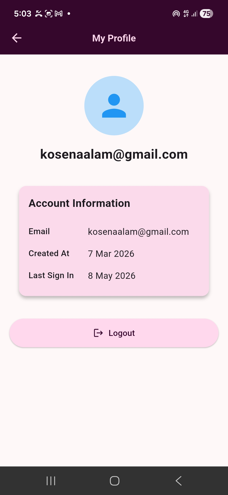
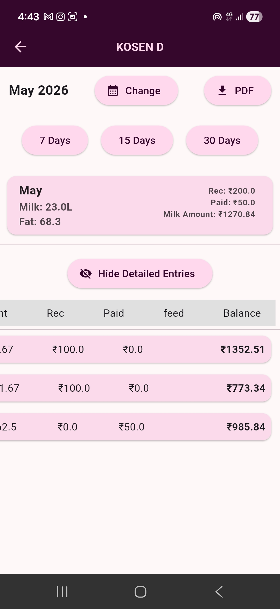
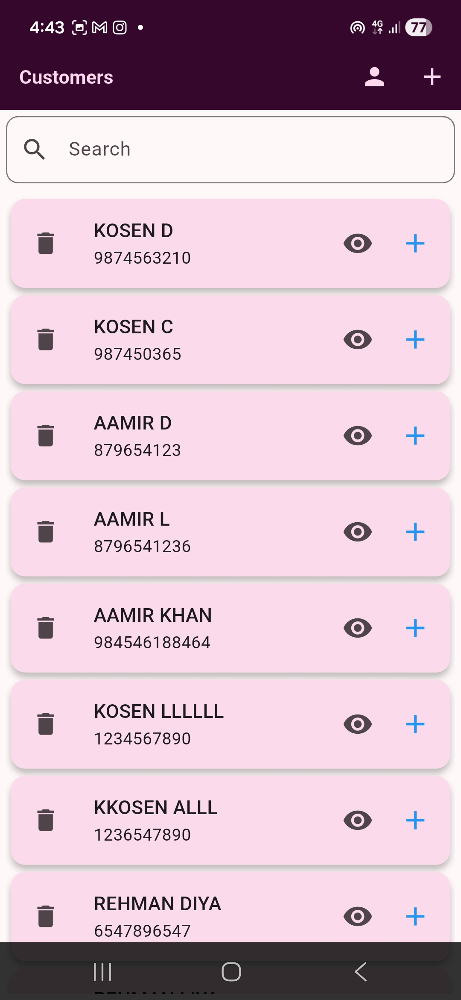
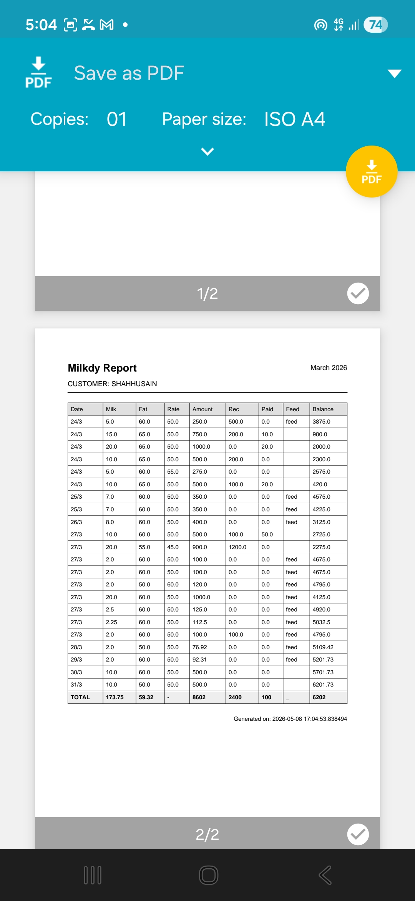

# 🥛 Milkdy — Smart Dairy Management Platform

## 👨‍💻 Developer Profile

**Name:**  Kosen Aalam
**Role:** Full Stack Mobile & Backend Developer
**GitHub:** https://github.com/Kosenaalam/milkdy
**LinkedIn:** https://linkedin.com/in/kosen
**Personal:** [Kosenaalam@gmail.com](mailto:kosenaalam@gmail.com)
**Email:** [support@milkdy.com](mailto:support@milkdy.com)
**Website:** https://milkdy.com

---

## ✨ screenshots of app
   
   <div align="center">






</div>

## 🚀 Overview

Milkdy is a **production-grade dairy management system** designed to digitize milk collection and distribution workflows with real-time financial tracking and scalable architecture.

It replaces manual bookkeeping with a **high-performance, accurate, and transparent system**.

---

## 🎯 Problem Statement

Traditional dairy systems suffer from:

* Manual record keeping
* Incorrect fat-based calculations
* Lack of financial transparency
* Frequent disputes between vendors and customers

---

## 💡 Solution

Milkdy provides a complete digital solution:

* Real-time milk entry tracking
* Automated fat-based pricing
* Smart ledger with running balance
* Monthly reports & PDF export
* Scalable backend for high user load

---

## 🔐 Authentication & Security

* Secure authentication using **Supabase Auth**
* User-based data isolation
* Session management
* Row-Level Security (RLS)

---

## ⚙️ Core Features

### 🥛 Milk Entry System

* Record daily milk (liters)
* Capture fat percentage
* Dynamic pricing (fat-based)

### 🔄 Dual Mode Support

* **Collection Mode** (milk received)
* **Distribution Mode** (milk given)

### 💰 Smart Ledger

* Automatic balance calculation
* Real-time updates
* Financial transparency

### 📊 Dashboard & Summary

* Total milk
* Total balance
* Last transaction tracking

### 📅 Monthly System

* Monthly aggregation
* Total amount / received / paid
* Report generation

### 📄 PDF Reports

* Professional downloadable reports
* Monthly data summaries

---

## 🧠 Engineering Highlights

* Eliminated full-table recalculation (O(N) → O(1))
* Implemented **summary table** for instant dashboard
* Used **indexed queries** for fast data retrieval
* Pagination-based loading for scalability
* Optimized Supabase RPC functions
* Designed for high-performance and minimal latency

---

## 🏗️ System Architecture

```text
Flutter App (Client)
        ↓
Supabase (PostgreSQL + RPC)
        ↓
Optimized Database Layer
        ↓
Summary Table + Indexed Queries
```

---

## 🛠️ Tech Stack

### Frontend

* Flutter (Material 3)

### Backend

* Supabase (PostgreSQL + RPC)

### Database

* PostgreSQL
* Indexed queries
* Summary table optimization

### Infrastructure

* Supabase Cloud
* Vercel (Website Hosting)

---

## 📊 Scalability

Milkdy is designed for high scalability:

| Metric               | Capacity            |
| -------------------- | ------------------- |
| Entries              | Millions of records |
| Users (current)      | 10K–50K             |
| With backend + cache | 1M+ users           |

Key optimizations:

* No heavy recalculation
* Pagination-based queries
* Lightweight payload
* Indexed database

---

## 💼 Business Model

* Freemium model
* Premium subscription (~₹49/month)

Premium includes:

* Unlimited customers
* Reports & analytics
* Data backup

---

## 🌍 Vision

To build a **globally scalable dairy management ecosystem** that brings transparency, efficiency, and financial accuracy to small and medium dairy businesses.

---

## 📦 Future Enhancements

* Offline-first support
* Multi-language support
* Advanced analytics
* Role-based access
* Payment integration
* AI-based pricing insights

---

## ⭐ Final Statement

Milkdy is a **real-world production system**, built with scalable architecture and optimized performance, capable of supporting **1 million+ users** with proper infrastructure scaling.
